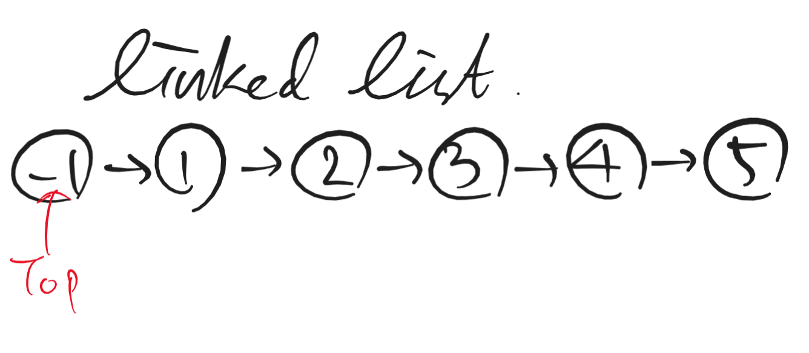
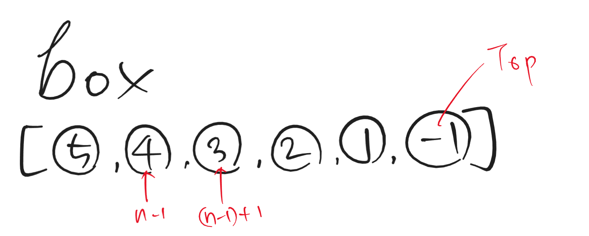
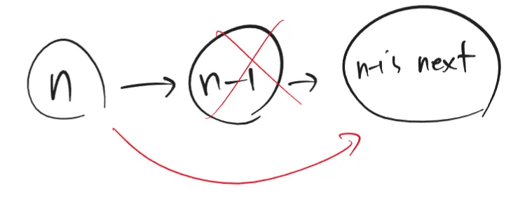

> 2024.12.28
> 

### [Remove Nth Node From End of List - LeetCode](https://leetcode.com/problems/remove-nth-node-from-end-of-list/)

---

# Approach

1. Create Top node. And Insert the head node into top’s next.


2. Create a list including all nodes in reversed order. When n = 2, n th number would be 4.


3. box[n-1]’s parent node is box[n].. To remove box[n-1], insert box[n-1]’s child node into box[n]’s child node.


---

# Code

```python
# Definition for singly-linked list.
# class ListNode:
#     def __init__(self, val=0, next=None):
#         self.val = val
#         self.next = next

from collections import deque
class Solution:
    def removeNthFromEnd(self, head: Optional[ListNode], n: int) -> Optional[ListNode]:
        # 1. Make Top node
        box = deque([])
        top = ListNode(-1)
        top.next = head

        # 2. Create new list including all nodes in reversed order.
        node = top
        while node:
            box.appendleft(node) # -> reversed order
            node = node.next

        # 3. Remove n th node
        box[n].next = box[n-1].next
        return top.next
```

---

# Complexity Analysis

**Time Complexity**: O(n) → Scanning all nodes in input ListNode.

**Space Complexity**: O(n) → New List includes n nodes’ addresses.

---

# Review

- Create new list → It allows easy reference to the n th node from the end of the list.
- Remove tips
    - Top node → Handle exception(Removing first node)
    - Insert child next into parent’s next.

---