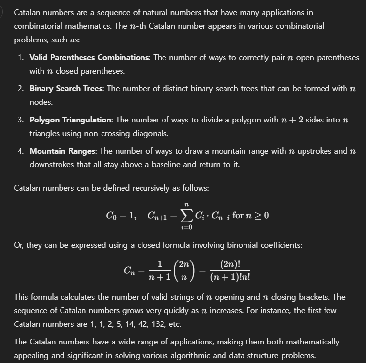

> 2024.12.28
> 

### [Generate Parentheses - LeetCode](https://leetcode.com/problems/generate-parentheses/)

---

# Approach

- Accumulate n th case. → Refer to previous strings and decide where to place '(' and ')' within each string.
- set_box → Avoid duplication.. If previous one is ‘()()’, the ‘()’ + ‘()()’ and ‘()()’ + ‘() are equal.

---

# Code

```python
from itertools import permutations, combinations

class Solution:
    def generateParenthesis(self, n: int) -> List[str]:
        box = deque([]) # list for returning answer
        for i in range(1, n+1):
            if i == 1: # Exception case (box is empty list)
                box.append('()')
            else: # box is not empty list
                size = len(box)
                set_box = set() # to avoid duplication.
                for _ in range(size):
                    # Take previous strings from box
                    parenthesis = box.popleft()

                    # Select 2 spots to place among previous string.
                    for front in range(0, len(parenthesis)):
                        for rear in range(front, len(parenthesis)):
                            # x = ~front + ( + front~rear + ) + rear~
                            x = parenthesis[:front:]
                            x += '('
                            x += parenthesis[front:rear:]
                            x += ')'
                            x += parenthesis[rear::]

                            # avoid duplication
                            if not x in set_box:
                                set_box.add(x)
                                box.append(x)
        # Returning
        return [x for x in box]
```

---

# Complexity Analysis

**Time Complexity**: `O(???)` 

- Iterating n accumulations. → O(n)
- Catalan numbers (from Chatgpt).. Too big..

---

**Space Complexity**: `O(???)` → Too big..

# Review

- The algorithm’s been come up with on Dynamic Programming. It’s not a optimized. But the Constrains is that 1≤n≤8. So I was not concerned about it.
- Catalan numbers

